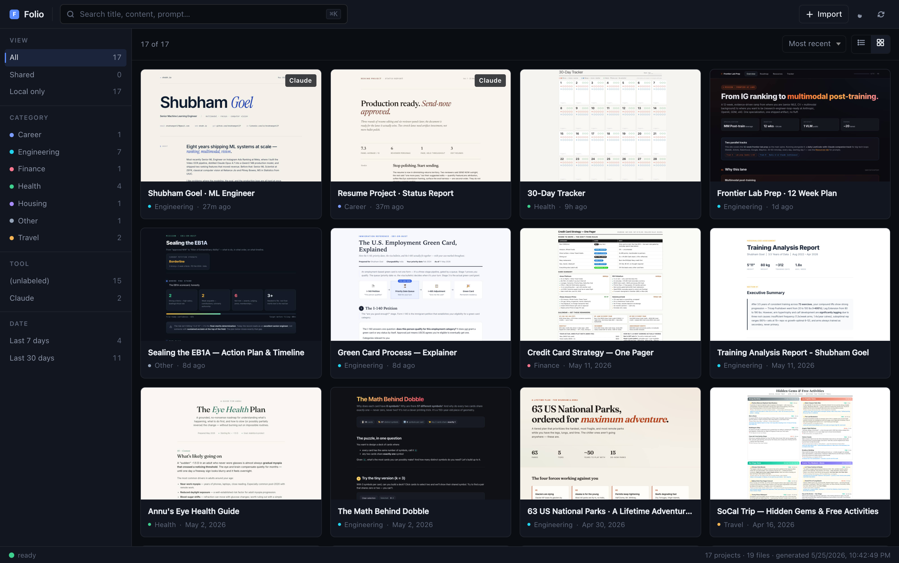
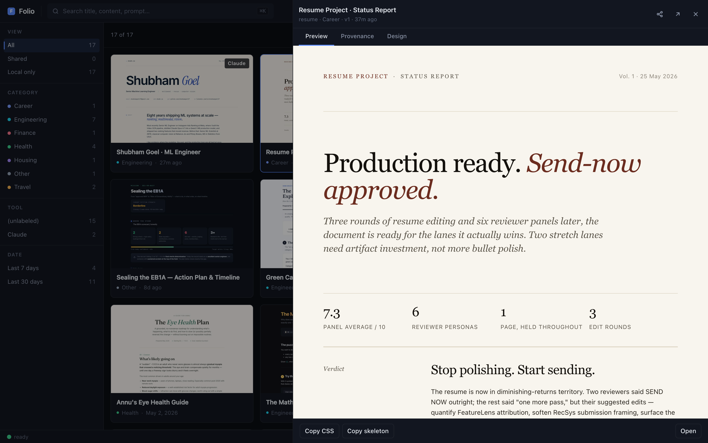
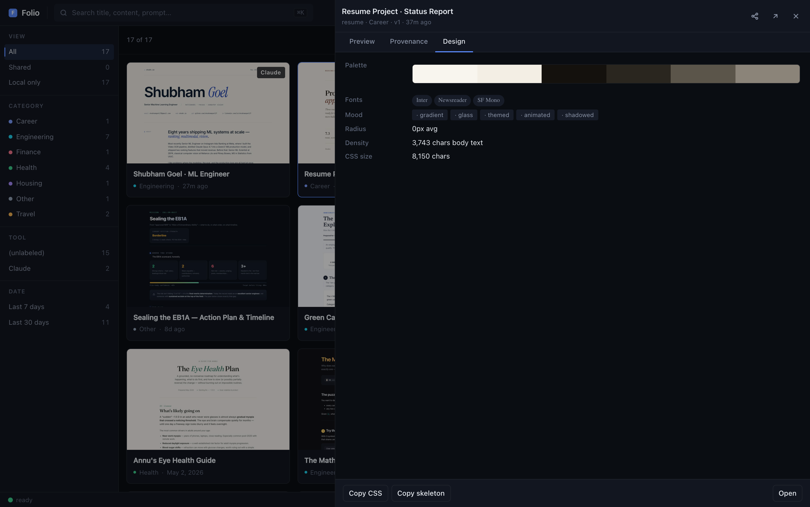
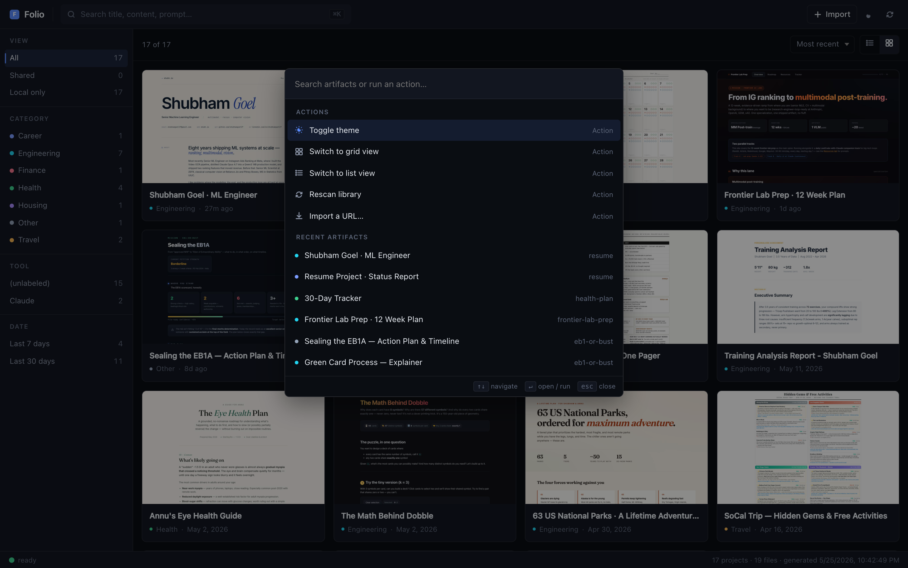

# Folio

**A local-first library for the stuff you make with AI.**



---

You've been generating a *lot* of HTML lately. Claude Artifacts. ChatGPT
Canvas. v0. Lovable. Cursor. They land in `~/Downloads` or some project
folder, you bookmark a tab, you mean to come back to that ROI calculator
you made three weeks ago — and then you can't find it.

That's the whole story of how this got built. I made a 30-day workout
tracker for my partner, lost it in a maze of folders, regenerated a
worse version, and decided to just build the index myself.

**Folio is that index.** It watches the folders where you save things,
indexes them with thumbnails + metadata, gives you a fast dashboard with
search + filters + a slide-out preview pane. Everything stays on your
disk. Nothing leaves.

There's also a Claude Code skill called `/craft` that generates new
artifacts in the style of your old ones — your library becomes the
design system for the next thing you make.

## Install

```bash
pipx install ai-folio
folio init
```

`folio init` walks you through it: pick a folder to watch (your Downloads,
your work dir, wherever AI stuff lands), and you're done. Run `folio` to
serve the dashboard.

```bash
folio                  # serve + open browser, keep this running
folio share <file>     # publish any artifact to a public URL (GitHub Pages)
folio import <url>     # pull a Claude / v0 / Lovable share URL into your library
folio install-skill    # install the /craft skill for Claude Code
folio doctor           # check setup; tells you exactly what to fix
```

The first run installs Playwright's headless chromium (~170 MB) for
thumbnail rendering. After that, only new/changed files re-shoot.

## What it does

**Auto-indexes** every `*.html` in your watched folders. Groups
`-v2`, `(1)`, `print` variants into one card with a version dropdown.
Skips templates, `.git` repos, and anything buried 3 levels deep —
so your library stays clean.

**Source-aware** — fingerprints Claude / ChatGPT / v0 / Lovable / Bolt
/ Gemini artifacts from HTML markers, tags each card. Also reads
`<meta name="folio:*">` tags (which the `/craft` skill emits).

**Searchable** — ⌘K palette runs across titles, prompts, intents, and
exposed actions (Toggle theme, Switch view, Rescan, Import).

**Visual** — every artifact gets a real screenshot thumbnail. Click a
card → slide-out preview with tabs for Provenance (where it came from)
and Design (palette swatches, fonts, mood flags).

**Shareable** — `folio share <file>` publishes to a public GitHub Pages
URL anyone can view. Free, durable, no infrastructure to run, URL
ready in 30-60s.

**Live** — `folio serve` watches your folders. Drop in a new artifact
and it appears in the dashboard within seconds, no refresh.




## The `/craft` skill

This is where it gets fun. After `folio install-skill`, in any Claude
Code session:

```
/craft a 30-day strength tracker for a beginner
/craft a one-pager comparing SF apartments
/craft a poker probability explainer, like dobble
```

The skill:

1. **Reads your library** (`folio designs`) to see what styles you've
   used. By default, picks a *different* direction so your next artifact
   doesn't look like the last one — actively fighting the "all AI output
   looks the same" trap.
2. **Inherits a style** if you reference one (`like dobble` →
   `folio designs <id> --template` loads dobble's CSS as the baseline).
3. **Applies 12 opinionated design principles** distilled from
   Refactoring UI, Linear's design philosophy, and Vercel/Geist
   (hierarchy via weight not size, tighten display tracking, color
   carries meaning, etc. — every one with a real source).
4. **Avoids 15 specific AI-slop signatures** (the purple-gradient hero,
   four identical bento cards, decorative emoji on every list item,
   glassmorphism, etc.).
5. **Saves to `~/folio-inbox/2026-05-26-<topic-slug>.html`** with
   embedded `<meta name="folio:*">` tags so it auto-indexes the moment
   it lands.

The output is a styled, self-contained HTML file that doesn't read like
it came from a generic prompt. Your past work becomes your style guide.

## ⌘K palette



Open it from anywhere in the dashboard. Top section runs **actions**
(toggle theme, switch view, rescan, import URL), bottom section
fuzzy-matches **artifacts** by title / prompt / intent. Linear /
Raycast pattern.

## Config

`~/Library/Application Support/folio/config.json` on macOS,
`~/.config/folio/config.json` on Linux:

```jsonc
{
  "roots": ["/Users/me/Downloads", "/Users/me/work"],
  "allow_repos": [],          // dirs with their own .git to include anyway
  "max_depth": 3,
  "drop_dir": null,           // where `folio import` saves (defaults to ~/folio-inbox)
  "enable_intent": false,     // opt-in LLM intent metadata (Claude Haiku)
  "categories": {             // extend or override the auto-tag keywords
    "Research": ["paper", "experiment", "ablation"]
  }
}
```

Cache (thumbnails, manifest, generated dashboard, Playwright chromium)
lives under `~/Library/Caches/folio/` (macOS) or `~/.cache/folio/`
(Linux). Wiping it just regenerates everything from your real files —
the cache is replaceable, your source files are sacred.

## Keyboard

| Key             | What |
|-----------------|------|
| `⌘K` / `Ctrl+K` | open palette (actions + artifact search) |
| `↵`             | open selected in preview pane / run action |
| `⇧↵`            | open selected in new tab |
| `Esc`           | close palette / preview |
| `/`             | focus the search box |
| Click card      | open in preview pane (in-app, no tab spam) |
| `⌘`/`Ctrl`-click | open in a new browser tab |

## Optional: AI intent layer

Folio's core is **fully local — no LLM, no network, no API key required**.

If you want richer metadata (a one-line intent line per artifact, topic
tags, audience detection — useful for search and the future closed-loop
generation features):

```bash
pipx install 'ai-folio[intent]'
export ANTHROPIC_API_KEY=sk-ant-...
folio scan --intent
```

~$0.003 per artifact with Claude Haiku, cached forever by content hash
so re-scans are free. ~$0.05 for 15 artifacts. Disable any time with
`folio scan --no-intent`.

## What Folio is not

- **Not a cloud product.** Nothing leaves your machine unless you
  explicitly `folio share`. There's no sign-up, no account, no Folio
  server somewhere. Your library is `~/folio-inbox/` and the dirs you
  pointed it at — that's it.
- **Not a replacement for git** or your existing file organization.
  It's a *lens* on whatever you already have.
- **Not opinionated about where your files live.** Multi-root by
  design. Want it to watch `~/Downloads` + `~/Documents` +
  `~/work/reports`? Run `folio add` three times.
- **Not trying to be everything for everyone.** Built for the specific
  pain of "where did I put that thing I generated last month."

## Why "Folio"

A folio is a working collection of pages that informs your next piece
of work. That's the whole vibe — your past artifacts become the
reference set for the next one. It's not an archive (cold storage),
it's a working library.

The PyPI package is `ai-folio` because `folio` is taken. The CLI
command is `folio`. Same pattern as `open-interpreter` / `interpreter`.

## Status

**v0.5, alpha.** Tested on macOS Sequoia; Linux should work but
hasn't been beaten on; Windows untested. Single-developer project
made in evenings — issues + PRs welcome, but I'm shipping what I
personally use rather than what's broadly polished.

If you try it and something feels off, [open an issue](../../issues/new) —
even one line is helpful, "the X button is confusing" is exactly the
feedback that improves things.

## Roadmap

In rough priority order:

- [ ] **Mobile dashboard** — currently breaks below 760px
- [ ] **`folio adopt <file>`** — opt-in consolidation into `~/folio-inbox/`
      for existing files (keeping the multi-root option for those who want it)
- [ ] **Cloudflare Pages backend** for `folio share` (alternative to GH Pages
      for users without `gh`)
- [ ] **`folio generate --like <id>`** — direct one-command artifact
      generation, opt-in via `[intent]` extra
- [ ] **Markdown rendering** — first-class support for `*.md` (currently
      HTML-only)
- [ ] **Semantic search** — when you genuinely don't remember the title
      but remember the gist
- [ ] **Version diff view** — when you iterate on a report v1/v2/v3, see
      what changed in design + content
- [ ] **A real test suite** — currently human-tested

## Made by

[@shubhamgoel27](https://github.com/shubhamgoel27) — built because I
genuinely needed it. If you find it useful, the best thing you can do
is star the repo so other people building with AI find it too.

The `/craft` skill in particular took real research to make
non-generic — the 12 design principles trace to specific chapters in
Refactoring UI, Linear's [Method](https://linear.app/method/introduction),
Vercel's [Geist](https://vercel.com/geist) design system, and a couple
of recent AI-slop critique articles. If you ship cool reports with it,
[tag me](https://twitter.com/shubhamgoel27) — I love seeing what
people make.

## License

MIT
