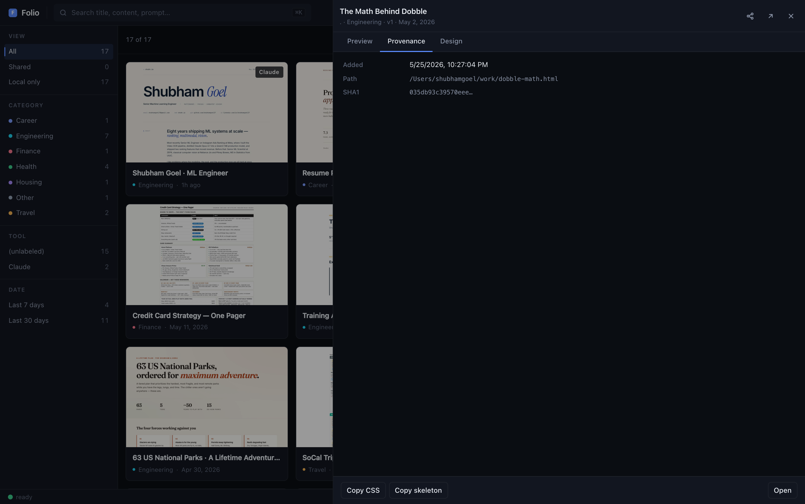

# Folio

**Your AI artifacts have a home now.** Index, search, preview, **share with one click**, and use your past work as the style guide for your next one.


---

> *"I've started preferring HTML as an output format instead of Markdown.
> The added expressiveness means I get overall better output, and the chance
> of someone actually reading your spec, report or PR writeup is much higher
> if it's in HTML. … When writing this article, I asked Claude Code to read
> through my code folder and find all the HTML files I've generated, group
> and categorize them …"*
>
> — Thariq, *[The Unreasonable Effectiveness of HTML](https://x.com/trq212/status/2052809885763747935)* (Claude Code team)

**Folio is that library.** If you're shifting from Markdown to HTML for
specs, reports, designs, prototypes, throwaway editors — the way Thariq
describes — Folio is where they live.

You've been making a lot of HTML with AI lately: Claude Artifacts,
ChatGPT Canvas, v0, Lovable, Cursor. They land in `~/Downloads` or some
project folder, you bookmark a tab, you mean to come back to that ROI
calculator you made three weeks ago — and you can't find it.

That's the whole reason this exists. I made a 30-day workout tracker
for my partner, lost it in a maze of folders, regenerated a worse
version, and decided to just build the index myself.

Local-first, fast, runs entirely on your machine. Plus the part where,
when you *do* want to share an artifact, it's one click to a permanent
public URL.

## Three things you can do

### 1. ✨ Share any artifact in seconds → public URL anyone can open

Click any card → hit the share icon → in ~30 seconds you get back a
permanent URL like `https://you.github.io/folio-share/abc12345.html`
that you can paste into iMessage, Slack, email, anywhere. URL is copied
to your clipboard automatically.

Free forever (uses your GitHub Pages quota — no Folio infrastructure,
no sign-up, no per-share fees, no expiry). Anyone with the link sees
the fully-rendered report; recipient needs nothing installed.



### 2. 📚 Browse everything you've made, in one place

Sidebar filters by tool, status (shared / local), category, date.
⌘K palette to jump to anything by name, prompt, or intent. Click → in-app
preview pane, no tab spam. Dark/light themes. Live auto-rescan — drop
a new file in any watched folder and it appears within seconds.


### 3. 🎨 Generate new artifacts that match your style — `/craft` skill

After installing the Claude Code skill, type `/craft a 30-day strength
tracker for a beginner` in any session. The skill:

- Reads your library to see styles you've used, then deliberately picks
  a *different* direction so your next artifact doesn't look like the
  last one (the "all AI output looks the same" problem, actively fought)
- OR inherits a specific style: `/craft a poker probability explainer,
  like dobble` — pulls dobble's actual CSS as the design baseline
- Applies 12 opinionated design principles distilled from Refactoring UI,
  Linear, and Vercel/Geist (every one cited)
- Avoids 15 specific AI-slop signatures (purple-gradient hero, identical
  bento cards, decorative emoji on every list item, glassmorphism, etc.)
- Saves to `~/folio-inbox/2026-05-26-<topic>.html` — auto-indexed in
  Folio within ~2 seconds

Your past work becomes your style guide for the next one. The loop closes.

## Install

### 🪄 Easiest: ask Claude Code to do it

If you have [Claude Code](https://claude.com/claude-code), paste this
prompt — Claude figures out the rest, installs everything, and walks
you through first-run:

> [!TIP]
> **Copy this into Claude Code:**
>
> ```
> Install Folio from https://github.com/shubhamgoel27/folio using pipx
> (or pip if pipx isn't installed). Then run `folio init` and help me
> pick a folder to watch. After that, run `folio install-skill` to set
> up the /craft skill. Open the dashboard when ready and tell me what
> to try first.
> ```

That's the whole install. No terminal commands to memorize, no
dependencies to debug — Claude handles the awkward parts.

### Or do it yourself

If you'd rather drive:

```bash
pipx install ai-folio          # or: pip install ai-folio
folio init                     # interactive wizard
folio                          # serves dashboard + opens browser
folio install-skill            # adds /craft to ~/.claude/skills/
```

Don't have `pipx`? Run `brew install pipx` (mac) or `python -m pip
install --user pipx` (anywhere), then the above.

### After install, in Claude Code

```
/craft a one-pager comparing three SF apartments
/craft a 30-day strength tracker, like my last one
/craft a probability explainer for poker, in the style of dobble
```

(Restart Claude Code once after `folio install-skill` so the skill loads.)

The first run installs Playwright's headless Chromium (~170 MB) for
artifact thumbnails. After that, only new/changed files re-shoot.

## What it actually does

**Auto-indexes** every `*.html` in your watched folders. Groups
`-v2`, ` (1)`, `print` variants into one card with a version dropdown.
Skips templates, `.git` repos, and anything buried 3 levels deep — your
library stays clean even when your folders aren't.

**Source-aware** — fingerprints Claude / ChatGPT / v0 / Lovable / Bolt
/ Gemini artifacts from HTML markers, tags each card with the tool that
made it. Also reads `<meta name="folio:*">` tags (which the `/craft`
skill emits) for zero-effort provenance.

**Visual** — every artifact gets a real screenshot thumbnail. Click a
card → slide-out preview pane with tabs for Provenance (source URL,
prompt, model, tags) and Design (palette swatches, fonts, mood flags).

**Live** — `folio serve` watches your folders. Drop in a new artifact
and it appears in the dashboard within ~2 seconds, no refresh.

**Searchable** — ⌘K palette runs across titles, prompts, intents, and
exposed actions (toggle theme, switch view, rescan, import). Linear /
Raycast pattern.


## All commands

```bash
folio                  # default: scan + serve + open browser
folio init             # interactive setup wizard
folio add <dir>        # watch another folder
folio roots            # list watched folders
folio scan             # one-shot rescan
folio open             # open the existing dashboard

folio share <file>     # publish to public URL + copy to clipboard
folio share --list     # all shares
folio share --revoke <id>   # take a public share down

folio import <url>     # fetch a public Claude/v0/Lovable share URL
folio link <file> --tool claude --source URL --prompt "..."
folio info <file>      # show provenance for a file

folio designs                     # list design fingerprints
folio designs <id> --template     # dump CSS + skeleton (paste into Claude)

folio inbox [topic]    # print the canonical path for a new artifact
folio install-skill    # install /craft into ~/.claude/skills/
folio doctor           # check setup; tells you exactly what to fix
```

## Config

`~/Library/Application Support/folio/config.json` on macOS,
`~/.config/folio/config.json` on Linux:

```jsonc
{
  "roots": ["/Users/me/Downloads", "/Users/me/work"],
  "allow_repos": [],          // dirs with their own .git to include anyway
  "max_depth": 3,
  "drop_dir": null,           // where `folio import` saves (default ~/folio-inbox)
  "enable_intent": false,     // opt-in LLM intent metadata (Claude Haiku)
  "categories": {             // extend the auto-tag keywords
    "Research": ["paper", "experiment", "ablation"]
  }
}
```

Cache (thumbnails, manifest, dashboard, Playwright Chromium) lives
under `~/Library/Caches/folio/`. Wiping it just regenerates everything
from your real files — cache is replaceable, your source files are sacred.

## Keyboard

| Key             | What |
|-----------------|------|
| `⌘K` / `Ctrl+K` | palette (actions + artifact search) |
| `↵`             | open selected in preview / run action |
| `⇧↵`            | open selected in new tab |
| `Esc`           | close palette / preview |
| `/`             | focus the search box |
| Click card      | open in preview pane (in-app, no tab spam) |
| `⌘`/`Ctrl`-click | open in a new browser tab |

## Optional: AI intent layer

Folio's core is **fully local — no LLM, no network, no API key required**.

If you want richer metadata (a one-line intent per artifact, topic tags,
audience detection — used for smarter search):

```bash
pipx install 'ai-folio[intent]'
export ANTHROPIC_API_KEY=sk-ant-...
folio scan --intent
```

~$0.003 per artifact with Claude Haiku, cached forever by content hash
so re-scans are free. ~$0.05 for 15 artifacts. Toggle off with
`folio scan --no-intent`. Skip the extra and the feature simply
doesn't appear.

## What Folio is not

- **Not a cloud product.** Nothing leaves your machine unless you
  explicitly `folio share`. There's no sign-up, no account, no Folio
  server somewhere. Your library is `~/folio-inbox/` and the dirs you
  pointed it at — that's it.
- **Not a replacement for git** or your existing organization. It's a
  *lens* on whatever you already have.
- **Not opinionated about where your files live.** Multi-root by
  design. Want it to watch `~/Downloads` + `~/Documents` +
  `~/work/reports`? Run `folio add` three times.
- **Not trying to be everything for everyone.** Built for the specific
  pain of "where did I put that thing I generated last month."

## Why "Folio"

A folio is a working collection of pages that informs your next piece
of work. Your past artifacts become the reference set for the next one.
It's not an archive (cold storage), it's a working library.

The PyPI package is `ai-folio` because `folio` was taken. CLI command is
`folio`. Same pattern as `open-interpreter` / `interpreter`.

## Status

**v0.5, alpha.** Tested on macOS Sequoia; Linux should work; Windows
untested. Single-developer project made in evenings — issues + PRs
welcome, but I'm shipping what I personally use rather than what's
broadly polished.

If you try it and something feels off, [open an issue](../../issues/new) —
even one line is helpful, "the X button is confusing" is exactly the
feedback that improves things.

## Roadmap

In rough priority order:

- [ ] **Mobile dashboard** — currently breaks below 760px
- [ ] **`folio adopt <file>`** — opt-in consolidation into `~/folio-inbox/`
      for existing files (keeping multi-root for those who want it)
- [ ] **Cloudflare Pages backend** for `folio share` (alternative to GH
      Pages for users without `gh` CLI)
- [ ] **`folio generate --like <id>`** — direct one-command generation,
      opt-in via `[intent]` extra
- [ ] **Markdown rendering** — first-class support for `*.md`
- [ ] **Semantic search** — when you remember the gist but not the title
- [ ] **Version diff view** — when you iterate v1/v2/v3, see what changed
- [ ] **A real test suite** — currently human-tested

## Made by

[@shubhamgoel27](https://github.com/shubhamgoel27) — built because I
genuinely needed it. If you find it useful, **starring the repo is the
single best thing you can do** so other people building with AI find it.

The `/craft` skill took real research to make non-generic — the 12
design principles trace to Refactoring UI chapters, Linear's
[Method](https://linear.app/method/introduction), Vercel's
[Geist](https://vercel.com/geist), and a couple of recent AI-slop
critique articles. If you ship cool reports with it, tag me — I love
seeing what people make.

## License

MIT
