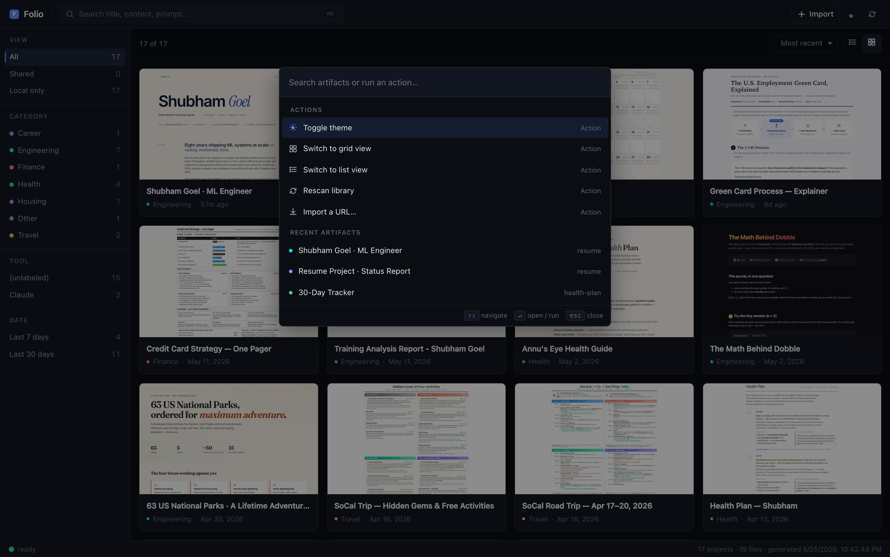
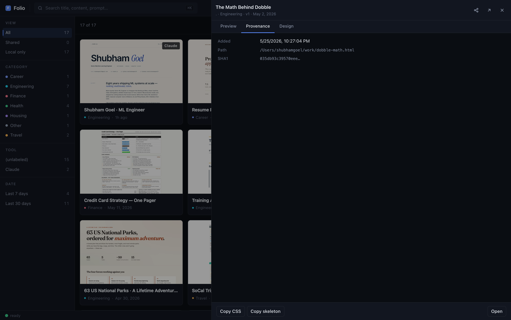

# Artifold

[](https://pypi.org/project/artifold/)
[](https://pypi.org/project/artifold/)
[](LICENSE)

**A library for the HTML you make with AI.** Artifold finds every page on
your disk, keeps its history, and makes it easy to find again and share.


## Why this exists

I made a 30-day workout tracker for my partner with Claude. A few weeks
later I couldn't find it. It was somewhere in a pile of project folders
and downloads, so I asked for it again and got a worse one.

That keeps happening once you start asking AI for HTML instead of text:
reports, trackers, explainers, itineraries, one-off tools. Each one is
useful, and each one lands wherever the session happened to be running.
Thariq on the Claude Code team described the same thing:

> *"I've started preferring HTML as an output format instead of Markdown.
> The added expressiveness means I get overall better output, and the chance
> of someone actually reading your spec, report or PR writeup is much higher
> if it's in HTML. … When writing this article, I asked Claude Code to read
> through my code folder and find all the HTML files I've generated, group
> and categorize them …"*
>
> Thariq, *[The Unreasonable Effectiveness of HTML](https://x.com/trq212/status/2052809885763747935)*

Artifold does that grouping and categorizing for you, continuously, on
your own machine.

## What it does

### Finds everything

Point it at a few folders and it indexes every HTML file in them. Each
artifact gets a screenshot thumbnail, a category, and a one-line
description of what it is for, so two similar cheat sheets are easy to
tell apart at a glance. Search covers titles, headings, opening text,
prompts and intents. `⌘K` jumps to anything.

It leaves out what isn't yours: `node_modules`, build output, cloned git
repos, server templates, and anything nested too deep.



### Keeps the history

Files named `report-v2.html` or `report (1).html`, or dated copies of the
same page, collapse into one card with a version picker and a diff view.
Pages you edit in place keep a revision history too, and a card shows
how many times you have revised or opened it. "Most used" sorts by that,
so the trackers you open every day stay near the top instead of sinking
under last week's one-offs.

### Shares in one click

Click share on any card and, usually within a minute, you get a permanent link
like `https://you.github.io/artifold-share/abc12345.html`, copied to your
clipboard. It publishes to your own GitHub Pages: free, no expiry, and
the person you send it to needs nothing installed. You can also export
any artifact to PDF.



### Works with any design skill

Artifold indexes HTML. It does not matter what wrote it: Claude, ChatGPT
Canvas, v0, Cursor, or one of the design skills people install on top of
them. What differs is how much Artifold can learn about each page.

| Made with | Artifold knows |
|---|---|
| **`/craft`** (bundled, see below) | everything: intent, the layout and style chosen, and the history of those choices |
| **[Hallmark](https://github.com/Nutlope/hallmark)** | layout, theme and brief, read from Hallmark's own stamp and log |
| **[taste-skill](https://github.com/Leonxlnx/taste-skill)**, **[huashu-design](https://github.com/alchaincyf/huashu-design)**, anything else | palette, fonts, design tokens, page structure, thumbnail, full-text search |

The last row needs nothing from the page and covers most of what Artifold
does. The first two rows exist because a page can say what it is in a few
lines of `<head>`. If you build a design skill, that format is documented
in [docs/ARTIFACT-METADATA.md](docs/ARTIFACT-METADATA.md), and nothing in
it is specific to Artifold. Skills with their own format are read through
[adapters](artifold/adapters.py); pull requests for new ones are welcome.

Run `artifold skills` to see which of these you have installed.

### Stays out of the way

A running `artifold serve` uses about 30 MB of memory and no CPU while
nothing changes. When a file changes, a rescan takes well under a second,
because unchanged files are recognized from their size and modification
time and never reread. While you are iterating on a page, its thumbnail
waits until you stop editing, so a burst of saves launches the headless
browser once instead of once per save.

## The bundled `/craft` skill

`/craft` is a Claude Code skill for making single-page HTML artifacts that
don't look like every other AI-generated page. It is optional: Artifold
works the same with Hallmark, taste-skill, or no skill at all.

Type `/craft a 30-day strength tracker for a beginner` and it:

- decides how much design the job needs, so a daily checklist stays quiet
  and a gift or a public page gets the full treatment
- edits the content before styling it: what the reader should remember,
  what to cut, and what belongs in a table or chart instead of prose
- picks a layout, a visual style, a tone of voice and one hand-built detail
  for this subject, and reads your library first so the new page doesn't
  repeat your last few
- avoids a long list of named AI-design habits (the purple gradient hero,
  identical cards, emoji bullets)
- renders the page in a headless browser and fixes what it finds
- saves it to `~/artifold-inbox/`, where it shows up in Artifold within
  seconds

You can also point it at something you made before: `/craft a poker odds
explainer, like dobble` starts from that page's actual CSS.

To see the difference, the [gallery](https://shubhamgoel27.github.io/artifold/)
runs eleven prompts through Claude twice, once plainly and once with an
earlier version of `/craft`.

## Install

### Let Claude Code do it

If you use [Claude Code](https://claude.com/claude-code), paste this:

> [!TIP]
> ```
> Install Artifold from https://github.com/shubhamgoel27/artifold using pipx
> (or pip if pipx isn't installed). Then run `artifold init` and help me
> pick a folder to watch. After that, run `artifold install-skill` to set
> up the /craft skill. Open the dashboard when ready and tell me what
> to try first.
> ```

### Or by hand

```bash
pipx install artifold        # or: pip install artifold
artifold init                # pick the folders to watch
artifold                     # scan, then open the dashboard
artifold install-skill       # optional: add /craft to Claude Code
```

No `pipx`? `brew install pipx` on a Mac, or `python -m pip install --user
pipx` anywhere. Restart Claude Code once after `install-skill` so it picks
up the skill.

The first scan downloads a headless Chromium (about 170 MB) for
thumbnails. After that only new or changed pages are captured.

## Commands

```bash
artifold                     # serve the dashboard and open it
artifold init                # setup wizard
artifold add <dir>           # watch another folder
artifold remove <dir>        # stop watching one
artifold roots               # list watched folders
artifold allow-repo <name>   # include a folder that is its own git repo
artifold scan                # rescan and rebuild the dashboard
artifold serve --no-open     # dashboard with live rescans, no browser tab
artifold open                # open the dashboard
artifold search <words>      # search from the terminal
artifold doctor              # check the setup and say what to fix

artifold share <file>        # publish to your GitHub Pages
artifold share --list        # everything you have shared
artifold share --revoke <id> # take a share down
artifold share --reconcile   # rebuild share records from what is published
artifold export-pdf <file>   # render an artifact to PDF
artifold trash <file>        # move an artifact to the system Trash

artifold import <url>        # save a public share (Claude, ChatGPT, v0, Lovable, …)
artifold link <file> --tool claude --source URL --prompt "..."
artifold info <file>         # show what Artifold knows about a file

artifold designs             # list design fingerprints
artifold designs <id> --template   # a page's CSS and structure, to reuse
artifold skills              # design skills, and what Artifold reads from each
artifold install-skill       # install /craft into Claude Code
artifold inbox [topic]       # the path where a new artifact should go
artifold config [key] [value]  # read or change a setting
```

## Settings

`artifold config` lists them; `artifold config <key> <value>` changes one.
The file lives at `~/Library/Application Support/artifold/config.json` on
macOS and `~/.config/artifold/config.json` on Linux:

```jsonc
{
  "roots": ["/Users/me/Downloads", "/Users/me/work"],
  "allow_repos": [],        // folders with their own .git to include anyway
  "max_depth": 3,           // how deep to look inside each watched folder
  "enable_intent": false,   // optional AI descriptions, see below
  "categories": {           // add your own category keywords
    "Research": ["paper", "experiment", "ablation"]
  }
}
```

Thumbnails, the dashboard and the browser live in
`~/Library/Caches/artifold/`. Deleting that folder is safe; the next scan
rebuilds it from your files.

## Keyboard

| Key | Does |
|---|---|
| `⌘K` / `Ctrl+K` | open the palette: search artifacts and run actions |
| `/` | focus the search box |
| `↑` `↓` then `↵` | pick a result in the palette |
| `Esc` | close the palette or the preview |

## Optional: AI descriptions

Artifold works without any AI or network access. Pages made with `/craft`
or Hallmark already describe themselves. For everything else, you can have
Claude Haiku write a one-line description of each artifact:

```bash
pipx install 'artifold[intent]'
export ANTHROPIC_API_KEY=sk-ant-...
artifold scan --intent
```

Each artifact costs at most about a third of a cent, and runs once: the
result is stored by content, so later scans reuse it until the page changes.

## What leaves your machine

Artifold has no server and no account, and the CLI holds no credentials
for anything. Your library is the folders you pointed it at.

The only thing that sends an artifact anywhere is `artifold share`, which
publishes the one artifact you pick to your own GitHub Pages.

## What it isn't

- **A replacement for git or your folders.** It reads what is already
  there and moves nothing.
- **A design tool.** Hallmark, taste-skill and huashu-design are all good;
  Artifold is where their output ends up and stays findable.
- **Tied to one folder.** Watch `~/Downloads`, `~/Documents` and a project
  folder at once.

## Status

Version 0.13, alpha. I use it every day on macOS; Linux should work;
Windows is untested. There are 175 tests and CI on Python 3.10 to 3.13.
It is a one-person project, so I build what I need first, but issues and
pull requests are welcome. If something is confusing, [open an
issue](../../issues/new); one line is enough.

## Roadmap

- [ ] A layout that works well on a phone
- [ ] `artifold adopt <file>` to move existing files into the inbox
- [ ] Cloudflare Pages as a sharing option for people without the `gh` CLI
- [ ] First-class Markdown files
- [ ] Search by meaning, for when you remember the gist but not the title

## Made by

[@shubhamgoel27](https://github.com/shubhamgoel27), because I needed it.
If it's useful to you, a star helps other people find it. If you make
something good with `/craft`, I'd like to see it.

## License

MIT
